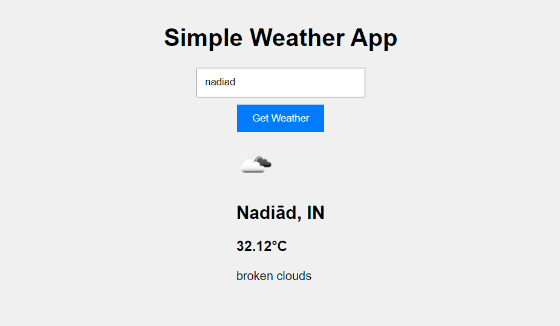

# Modern Weather App

This is a simple weather app created using React. It allows users to search for weather information by city name and displays the current weather conditions.

## Features

- Search for weather by city name
- Display current weather information
- Responsive design for mobile and desktop

## Technologies Used

- React
- OpenWeatherMap API

## Getting Started

To run this app locally, follow these steps:

1. Clone the repository: `git clone https://github.com/Deadsec19/weather-app.git`
2. Navigate to the project directory: `cd weather-app`
3. Install dependencies: `npm install`
4. Open the App.js file located in the src directory of your project, locate the fetchWeatherData function and replace 'YOUR_API_KEY' in the API URL with your actual API key.
5. Start the development server: `npm start`
6. Open [http://localhost:3000](http://localhost:3000) in your browser to view the app.

## API Key

You will need to sign up for a free account at [OpenWeatherMap](https://home.openweathermap.org/users/sign_up) to get an API key. Replace `YOUR_API_KEY` in the `.App.js` file with your actual API key.

## License

This project is licensed under the MIT License - see the [LICENSE](LICENSE) file for details.

## Live Demo

Check out the live demo of the app [here](https://simple-weather-9000.netlify.app/).
